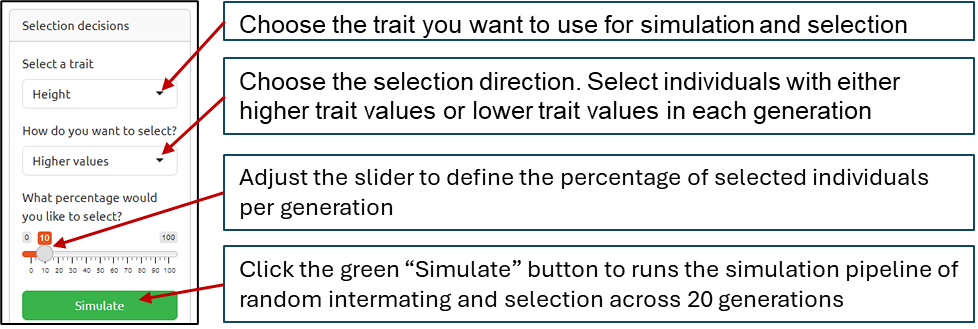
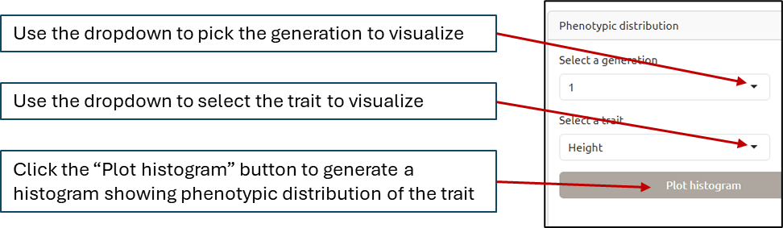
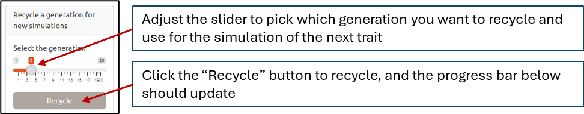
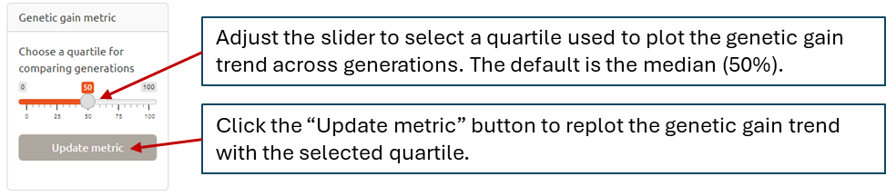
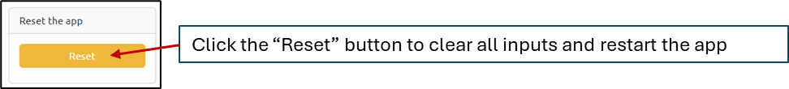

# ViSAGE

## 1. About ViSAGE

ViSAGE is an R shiny app developed to use **Vi**sualization and **S**imulation for **A**dvancing **G**enetics **E**ducation. The app simulates selective breeding scenarios based on user-defined inputs. It runs twenty cycles of selection and produces graphs and cartoons for visualizing phenotypic changes across generations.
This document provides instructions on how to install and run ViSAGE. Thanks for using *ViSAGE*!

## 2. How to install ViSAGE?

### 2.1. First install R and RStudio

Installing and running ViSAGE on the local computer requires the installation of R and RStudio.
To install R, go to the official R website: <https://cran.r-project.org>. Click on the appropriate link for your operating system: "Download R for Windows" or "Download R for macOS".
Run the downloaded installer and follow the setup instructions (default options are fine).

To install RStudio, go to the RStudio download page: <https://posit.co/download/rstudio-desktop/>. Scroll down to the RStudio Desktop and click the download link for your operating system (Windows or macOS).
Run the downloaded installer and complete the installation. Finally, open RStudio from your applications, and it should automatically detect R installation.

### 2.2. Downloading the app

The repository can be downloaded manually from GitHub or cloned from the command line.
To download manually, go to the GitHub repository page and click the green “Code” button, then select “Download ZIP”. After downloading, unzip the folder to access the files.

To clone the repository using the command line, open a terminal or command prompt and run:

`git clone https://github.com/Boris-alladassi/ViSAGE.git`

This will create a local copy of the repository on your computer. Make sure you have Git installed before using this command.

### 2.3. Setting working directory

To begin, unzip the folder downloaded, if done properly a new folder will be created named **ViSAGE**. Now, open R or R Studio and set your working directory to this folder **ViSAGE**.\
You may use the keyboard shortcut `Ctrl+Shift+H` (for Windows, probably `Cmd+Shift+H` for Mac), or you may edit the code below to set the working directory to the relative path where the directory is located on your computer.

`setwd("C:/Users/aboris/Documents/Postdoc/code/ViSAGE")`

### 2.4. Source the *app.R* file

Next, source the *app.R* file to get **ViSAGE** ready for running. Please use the code below after you have set your working directory to ViSAGE.

`source("./app.R")`

This may take a while, as it will install all the required R packages, that you currently do not have.

### 2.5. Run ViSAGE

**ViSAGE** can now run using the code below.

`shiny::runApp()`

At this point, the app should be up running. Please test the app as thoroughly as you can. Explore both the Standard and Fun panels. Record any abnormal behavior and share your feedback and suggestions with me at [**aboris@illinois.edu**](mailto:aboris@illinois.edu)

### 2.6. Alternative access to ViSAGE

If a user is not able to install and run the app on their local computer, they can access it at <https://borisalladassi.shinyapps.io/visage/>. Simply copy and paste the URL in your browser, and it will start running. **It is worth noting that due to memory limitation, running the app from a the URL is much slower than running it locally.**  

## 3. How to use ViSAGE?

The app has two panels, *Standard* and *Fun*. The Standard panel simulates additive genetic architectures of plant height, girth (stem diameter), and tassel length of maize. The fun panel simulates relatively simple additive genetic architectures of three traits in maize, avocado, and strawberry.

### 3.1. Standard panel

#### 3.1.1. Selection decisions

To run the simulation pipeline in ViSAGE, the user needs to define the trait of interest, selection direction (higher values or lower values), and selection intensity. Once these selection decisions are made, the user runs the simulation by clicking on the ***Simulate*** button.

#### Visulization of simulation results

The simulation results are visualized in two sections—genetic gain plot and phenotypic changes.
The genetic gain plot shows the temporal trend of the user-defined phenotypic quartile across the 20 generations. The section of phenotypic changes is an interactive canvas display (powered by JavaScript) that visually reflects phenotypic changes across generations.

Additionally, the user can visualize the phenotypic distribution of a given trait and generation using the options under the "Phenotypic Distribution" section.

#### Recycle a Generation

In ViSAGE, selection focuses on one trait at a time. After reaching a desirable value for a trait, the improved individuals, at a given generation, are recycled and used to begin the selection for the next trait.

#### Genetic Gain Metric

The median is the default metric used to visualize the genetic gain trend. The user can change the metric by selecing another quartile and update the metric.

#### Reset the App

The user can reset the app at any time to clear all inputs and restart the app. This option is useful when a user desires to restart current simulation scenario or initiate a new simulation scenario.

### 3.2. Fun panel

The instructions about using the **Fun panel** are identical to those of the **Standard panel** except an additional dropdown bar in the selection decisions section that enables the user to select a crop of choice among corn, avocado, and strawberry.

## 4. Authors

Boris M.E. Alladassi [aboris@illinois.edu](mailto:aboris@illinois.edu)
Alex E. Lipka [alipka@illinois.edu](mailto:alipka@illinois.edu)
