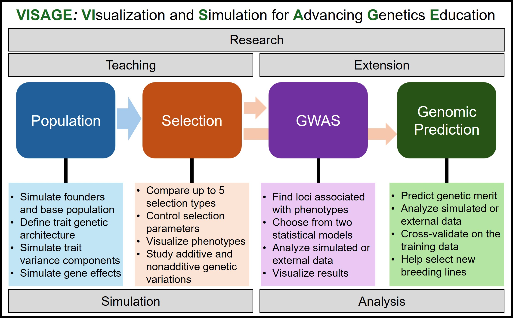
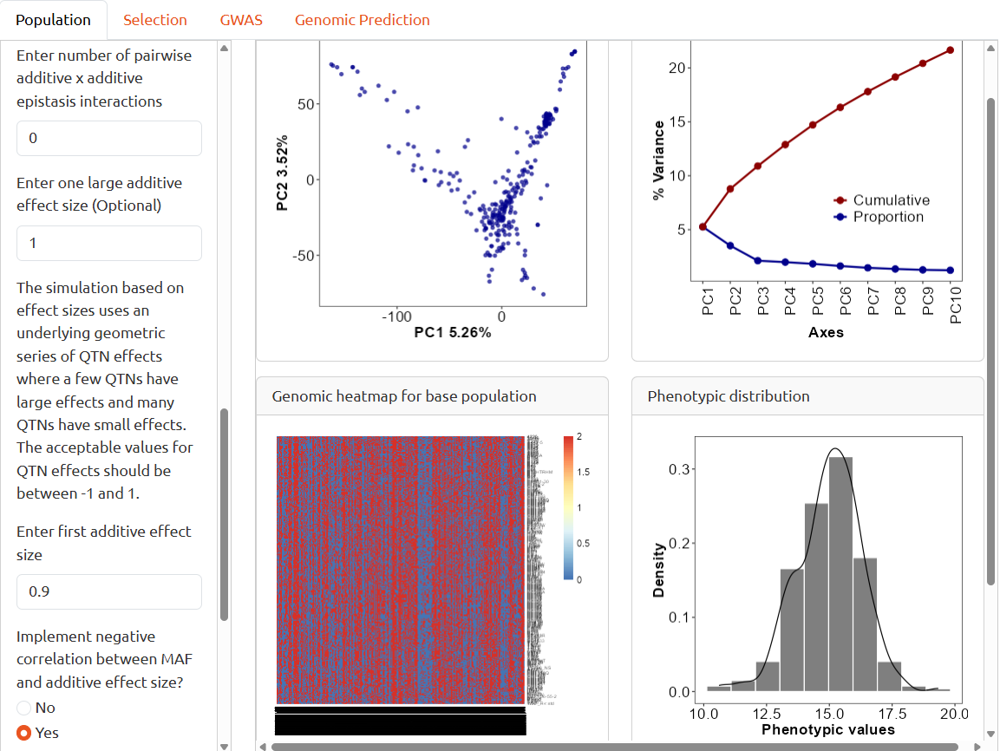
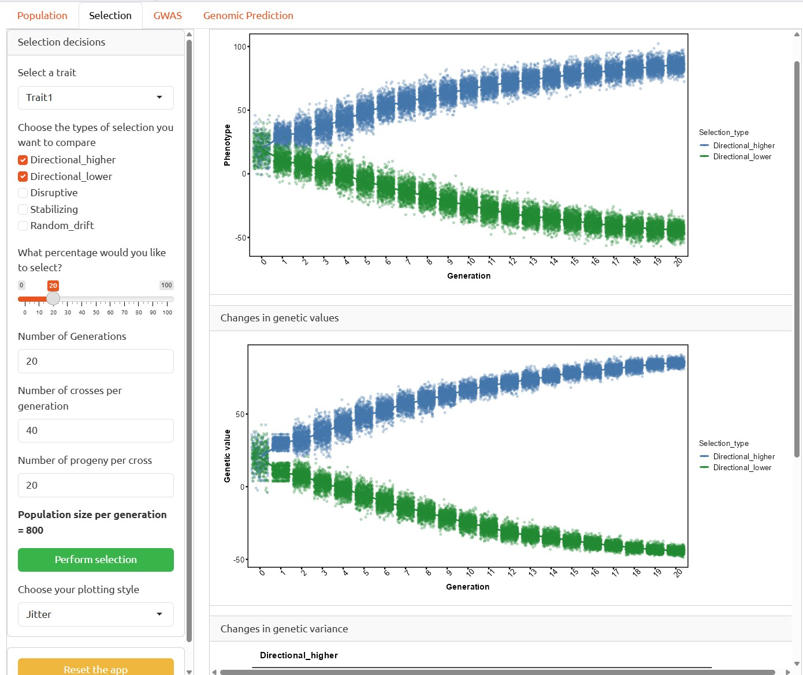
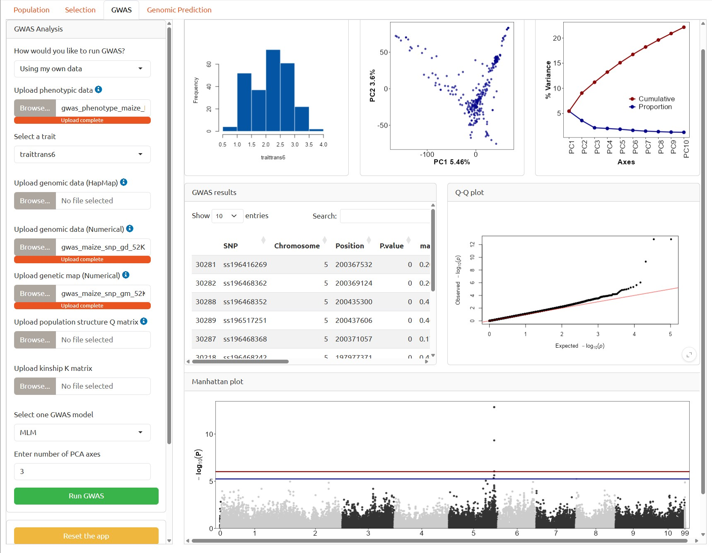
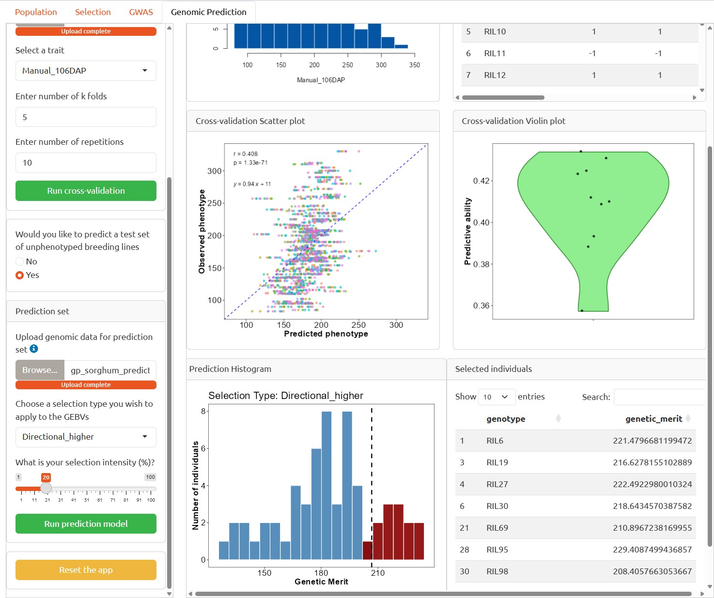

# **VISAGE**

**VI**sualization and **S**imulation for **A**dvancing **G**enetics **E**ducation. 

<!-- badges: start -->
<!-- badges: end -->
## About VISAGE

**VISAGE** is an R shiny app developed to conduct simulations and analyses of quantitative traits often encountered in plant and animal breeding.  

The app provides an interactive interface for users to:

- Simulate quantitative traits with additive, dominance, and epistasis architectures.
- Conduct multi-generation selection using either a directional, stabilizing or diruptive selection type.
- Conduct genome-wide association studies (GWAS) and genome-wide prediction analyses.  

This document provides instructions on how to install and run VISAGE. Thanks for using **VISAGE**!

## Installation

Run the code below to install the development version of VISAGE from [GitHub](https://github.com/):

``` r
install.packages("pak")
pak::pak("Boris-alladassi/VISAGE")
```

## Run VISAGE

After installing the package, you can run the app using the code below:

``` r
library(VISAGE)
VISAGE::run_VISAGE()
```

## Overview of VISAGE

## Intro

VISAGE (Visualization and Simulation for Advancing Genetics Education) is an interactive R Shiny application designed to help users simulate breeding populations and explore common genotype-to-phenotype analyses. The application includes four main panels: **Population**, **Selection**, **GWAS**, and **Genomic Prediction**. The first two panels support genetic simulation and multi-generation selection, while the GWAS and Genomic Prediction panels provide tools for analyzing simulated or user-provided data.



## Population Panel

The **Population** panel allows users to create founders and base populations and simulate quantitative traits. Users can either generate virtual genomic data using functions from **AlphaSimR** or import external genomic datasets, allowing traits to be simulated on actual pre-genotyped populations. Users can also define the genetic architecture of simulated traits using additive, dominance, and epistatic effects. The number of quantitative trait nucleotides (QTNs), trait mean, and broad-sense heritability can all be specified.



## Selection Panel

The **Selection** panel enables users to conduct multi-generation selection using the population and trait generated in the Population panel. Five selection types are available: **directional high, directional low, stabilizing, disruptive, and random drift**. Users can define the number of generations to simulate and the population size for each generation.



## GWAS Panel

The **GWAS** panel allows users to perform genome-wide association studies using either simulated data generated through the Selection panel or external datasets. For the external data, the marker data can be imported in either **HapMap** or **numerical** format. VISAGE uses the **GAPIT** R package to conduct GWAS and provides two statistical models: the **general linear model (GLM)** and **mixed linear model (MLM)**. Principal component analysis (PCA) results are also provided to help users evaluate population structure and determine appropriate fixed-effect covariates for the GWAS.



## Genomic Prediction Panel

The **Genomic Prediction** panel uses functions from the **rrBLUP** R package to evaluate the predictive ability of the RR-BLUP genomic prediction model. Users can first train a model on their training set and then use the model to prediction the prediction or test set. For the model training phase, predictive ability can be evaluated using **k-fold** or **leave-one-genotype-out cross-validation**. If the user wishes to predict an test set, VISAGE then fits the trained RR-BLUP model to predict the genetic merits of the test set, often called GEBVs. Genotypes can then be ranked according to their predicted GEBVs and selected based on the user-defined selection type and intensity. If the analysis was performed on simulated data, observed trait values will be available, thus, VISAGE also provides a scatterplot of observed phenotypes versus GEBVs and calculates a coincidence index to evaluate agreement between phenotypic and genomic selection.



## Authors

If you have any questions, comments, or suggestions, please feel free to reach out to us!  
Boris M.E. Alladassi [aboris@illinois.edu](mailto:aboris@illinois.edu)  
Alex E. Lipka [alipka@illinois.edu](mailto:alipka@illinois.edu)  
